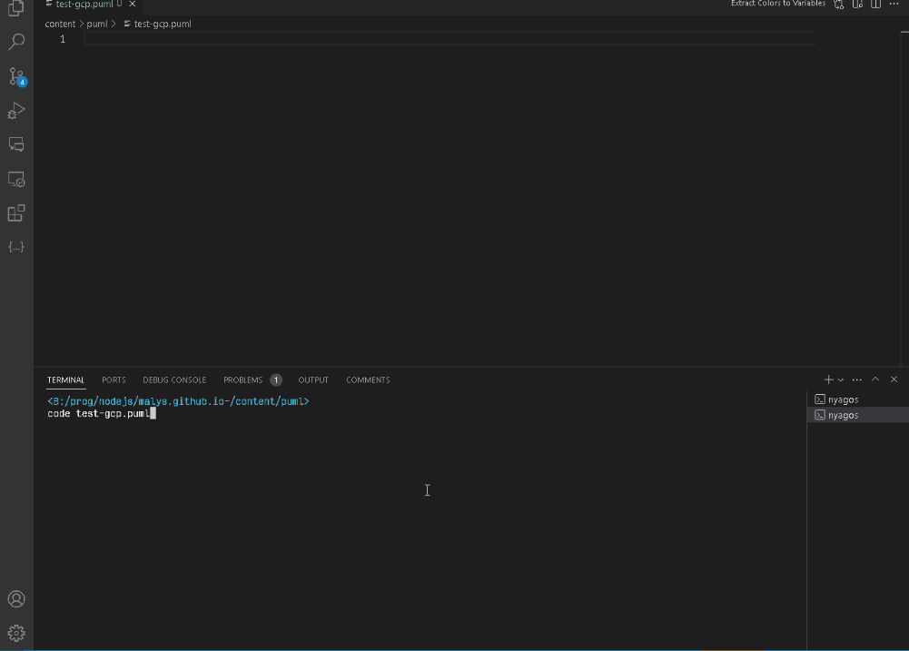

# Plantuml Helpers for productivity

Tooling to generate autocompletion for VSCode "complete from files"  and snippets from public plantuml documentation.

The main idea behind this project is too autogenerate autocompletion and snippets files from always updated official documentation or repositories.
It's not perfect but it's  a real help.

## Installation

* Install [vscode-complete-from-file](https://github.com/rioj7/vscode-complete-from-file)
* Download latest release, see example script: **update.sh**

<details>
  <summary>In Action</summary>


</details>

* Configure `vscode-complete-from-file` entension to load files from *plantuml-helpers*
```json
"complete-from-file.documents": {
     "gcp": {
      "documentSelectors": [
        {
          "language": "plantuml",
          "scheme": "file",
          "pattern": "**/*gcp.puml"
        }
      ],
      "files": [
        "${workspaceFolder}${pathSeparator}.vscode${pathSeparator}plantuml-helpers${pathSeparator}plantuml-C4.complete",
        "${workspaceFolder}${pathSeparator}.vscode${pathSeparator}plantuml-helpers${pathSeparator}plantuml-themes.complete",
        "${workspaceFolder}${pathSeparator}.vscode${pathSeparator}plantuml-helpers${pathSeparator}plantuml-awslib14.complete",
        "${workspaceFolder}${pathSeparator}.vscode${pathSeparator}plantuml-helpers${pathSeparator}plantuml-gcp.complete",
        "${workspaceFolder}${pathSeparator}.vscode${pathSeparator}plantuml-helpers${pathSeparator}plantuml-tupadr3.complete",
        "${workspaceFolder}${pathSeparator}.vscode${pathSeparator}plantuml-helpers${pathSeparator}plantuml-material.complete",
        "${workspaceFolder}${pathSeparator}.vscode${pathSeparator}plantuml-helpers${pathSeparator}plantuml-logos.complete",
        "${workspaceFolder}${pathSeparator}.vscode${pathSeparator}plantuml-helpers${pathSeparator}plantuml-office.complete",
        "${workspaceFolder}${pathSeparator}.vscode${pathSeparator}plantuml-helpers${pathSeparator}plantuml-k8s.complete"
      ]
    }
}
```
* Create symlinks of *release* folder in *.vscode* folder of your project

## Usage

### Snippets

Type **p{{mode}}** where @start{{mode}}...@end{{mode}}

ex: puml,pgan(tt),pmin(dmap)

### Autocompletion

Type **include + CTRL+SPACE**

<details>
  <summary>In Action</summary>



</details>