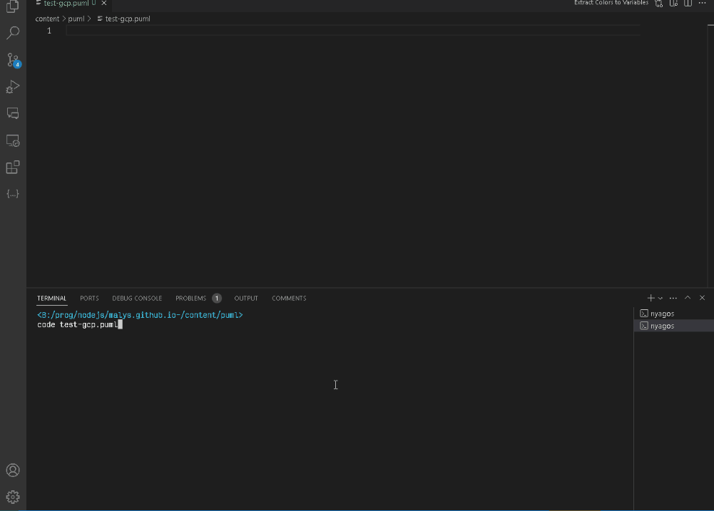
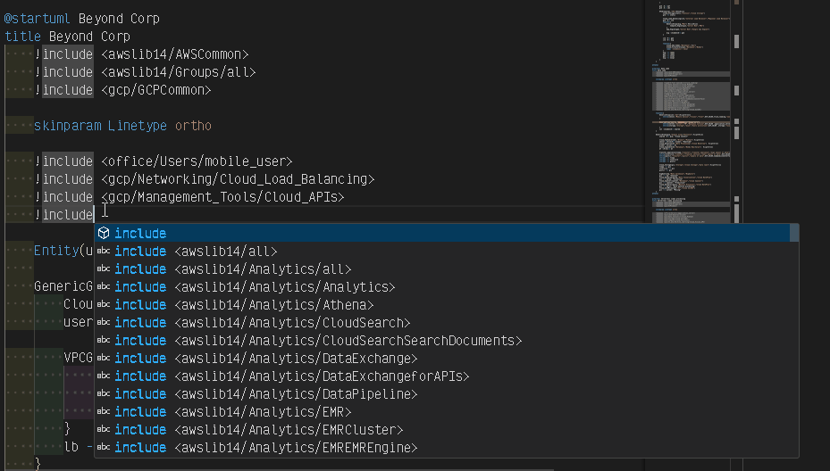

# Plantuml Helpers for productivity

Tooling to generate autocompletion for VSCode "complete from files"  and snippets from public plantuml documentation.

The main idea behind this project is too autogenerate autocompletion and snippets files from always updated official documentation or repositories.
It's not perfect but it's  a real help.

## Installation

### [vscode-complete-from-file](https://github.com/rioj7/vscode-complete-from-file)

* VSCode: `code --install-extension rioj7.complete-from-file`
* VSCodium
```xonsh
extension="rioj7.complete-from-file"

tab=extension.split(".")
publisher=tab[0]
package=tab[1] 
version="latest"
download_url=f"https://{publisher}.gallery.vsassets.io/_apis/public/gallery/publisher/{publisher}/extension/{package}/{version}/assetbyname/Microsoft.VisualStudio.Services.VSIXPackage"
file= "temp.vsix"

# Download the VSIX file using the constructed URL, overwriting if it exists
curl -L -o @(file) @(download_url)

print("Download process completed")
codium --install-extension @(file)

rm @(file)
```
### Autocompletion

* Download latest release
* Unzip file in `.vscode` local folder
* Or create symlinks of *release* folder in *.vscode* folder of your project

## Configuration

* Configure `complete-from-file` extension to load files from *plantuml-helpers*
```json
"complete-from-file.documents": {
     "gcp": {
      "documentSelectors": [
        {
          "language": "plantuml",
          "scheme": "file",
          "pattern": "**/*gcp.puml" //apply autocompletion only on this pattern
        }
      ],
      "files": [ //List of autocompletions
        "${workspaceFolder}${pathSeparator}.vscode${pathSeparator}plantuml-helpers${pathSeparator}plantuml-plantuml-stdlib-C4.complete",
        "${workspaceFolder}${pathSeparator}.vscode${pathSeparator}plantuml-helpers${pathSeparator}plantuml-plantuml-stdlib-themes.complete",
        "${workspaceFolder}${pathSeparator}.vscode${pathSeparator}plantuml-helpers${pathSeparator}plantuml-plantuml-stdlib-awslib14.complete",
        "${workspaceFolder}${pathSeparator}.vscode${pathSeparator}plantuml-helpers${pathSeparator}plantuml-plantuml-stdlib-gcp.complete",
        "${workspaceFolder}${pathSeparator}.vscode${pathSeparator}plantuml-helpers${pathSeparator}plantuml-plantuml-stdlib-tupadr3.complete",
        "${workspaceFolder}${pathSeparator}.vscode${pathSeparator}plantuml-helpers${pathSeparator}plantuml-plantuml-stdlib-material.complete",
        "${workspaceFolder}${pathSeparator}.vscode${pathSeparator}plantuml-helpers${pathSeparator}plantuml-plantuml-stdlib-logos.complete",
        "${workspaceFolder}${pathSeparator}.vscode${pathSeparator}plantuml-helpers${pathSeparator}plantuml-plantuml-stdlib-office.complete",
        "${workspaceFolder}${pathSeparator}.vscode${pathSeparator}plantuml-helpers${pathSeparator}plantuml-plantuml-stdlib-k8s.complete"
      ]
    }
}
```

## Usage

### Snippets

Type **p{{mode}}** where @start{{mode}}...@end{{mode}}

ex: puml,pgan(tt),pmin(dmap)

### Autocompletion

Type **include + CTRL+SPACE**

<details>
  <summary>In Action</summary>



</details>

### Tips

* Increase suggestion popup size in VSCode
  
<details>
  <summary>In Action</summary>



</details>